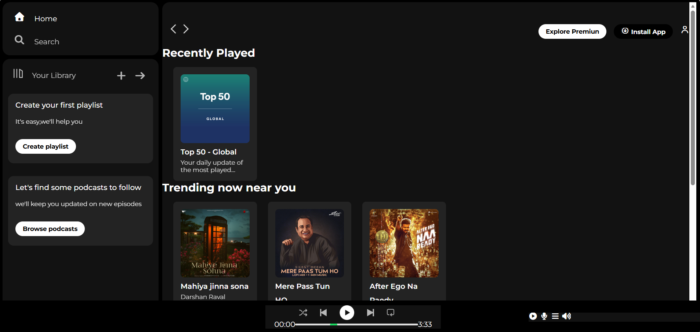

# 🎵 Spotify Clone

A modern Spotify Clone built using **HTML** and **CSS**, featuring a clean, responsive, and visually appealing user interface inspired by Spotify.

---

## 🚀 Features

- 🎵 Spotify-inspired user interface
- 📱 Responsive design
- 🎨 Modern and clean layout
- 📂 Organized project structure
- 💻 Beginner-friendly code

---

## 🛠️ Technologies Used

- HTML5
- CSS3

---

## 📁 Project Structure

```
SPOTIFY-CLONE
│
├── assets/
├── index.html
├── style.css
└── README.md
```

---

## ▶️ How to Run

1. Download or clone the repository.
2. Open the project folder.
3. Open `index.html` in your browser.

---

## 📸 Screenshot



---

## 👩‍💻 Author

**Shruti Ingle**

GitHub: https://github.com/ingle-shruti
